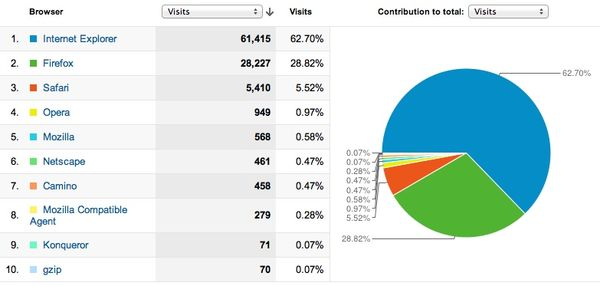
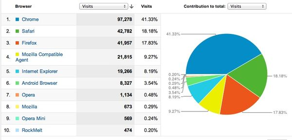

.. include:: ../LINKS.rst

JS预备
==============

- 什么是 `crx`_ ?
- 什么是 `JavaScript`_ ?

一切开始前,先必须 `相信` !

相信 Chromium
----------------------------------------------------
嗯嗯嗯?! `crx`_ 是什么? 为毛俺要学习开发这货?

- 先看Fred Wilson从自己网站 `AVC <http://www.avc.com/a_vc/2012/06/browser-loyalty-or-not.html>`_ 的访问数据图表:

  - 2006年 |bwar2006|
  - 2012年 |bwar2012|

如此剧烈的变化,就在36个月完成了反复逆转！这就是!

- |chromelogo| `Chrome`_ , 来自 `Google`_ 公司的神奇浏览器
- 核心组件是来自 `Apple`_ 公司的 `Safari`_ 使用的 `WebKit`_ 开源HTML引擎, 以及 `Google`_ 独力研发的 `V8`- `JavaScript`_ 解析引擎
- 其中 `V8`_ 被单独抽取出来,变成了 `node.js`_ 项目的核心 ~ 一种可以在服务器端运行 `JavaScript`_ 提供应用服务的应用框架
- 更加牛叉的是 `Chrome`_ 虽然是 `Google`_ 的专用软件产品,但是从一开始就有对应的开源工程 |chromiumlogo| `Chromium`_
- 所有代码完全一致!
- 因而,基于 `Chromium`_ 已经形成了一大批非官方发行版, 仅仅在中国就至少有5种发行版!
- 进一步牛叉的是: 只要是基于 `Chromium`_ 代码发行的浏览器,都可以安装/使用 `crx`_ ~ 扩展程序!
- 即,我们只要学会了 `crx`_ 的开发,那么我们的作品,基本上可以运行于占人数互联网中近一半用户的浏览器中!

所以,相信 `Chromium`_ 将在 `浏览器战争`_ 中保持不败!
只要掌握了 `crx`_ 的开发,就能进入浏览器扩展的主流市场!

相信JS
-------------

- `Nirvana Studio » Blog Archive » JavaScript：世界上最被误解的语言 <http://skm.zoomquiet.org/data/20060622200239/index.html>`_

    - `Javascript的10个设计缺陷 - 阮一峰的网络日志 <http://www.ruanyifeng.com/blog/2011/06/10_design_defects_in_javascript.html>`_

...

仅仅是因为以前的 DHTML 体验,就认定 JS 是前端的命! 基本很难相信了
- 不相信,那么任何乱入行为,都会被自个儿否决
- 那真心没招了,,, 说明, `JavaScript`_ 不是你的那份儿菜,甭忙了,继续 C++/JAVA/.NET 吧,,,

.. warning:: 但是

    - 你选择了相信 `JavaScript`_ 的可能性,愿意体验这种前后合体式的业务开发形式 ?!
    - ~~~ 那么, **go!**

只要明确一些 `JavaScript`_ 的`基本形式` 80% 的实际编程就可以混进去了 `!-)` :

严正推荐: `JavaScript - MDN <https://developer.mozilla.org/en/JavaScript>`_
- 组织良好的所有相关资料!

中文的推荐:
- `JavaScript 教程 <http://www.w3school.com.cn/js/index.asp>`_
- `JavaScript 参考教程 <http://www.jb51.net/shouce/javascript/>`_

基本语法
--------------

.. code-block:: js

    // 单行注释
    /*
        多行
        注释
    */
    var a="hollo"
    var b= 1
    b++   //  自增运算,此时 b 为2
    b--   //  自减运算,此时 b 为1
    var c = b+a //字串连接,连接数字会自动转换类型

    if (1 != c){}   // 不等于
        console.log("Yes")
        // 不论前台还是后台开发,都不建议使用 alert() 进行调试输出了,,
    }else{
        console.log("No")
    }

    for (i = 1; i < 10; i++){
        console.log("hollo:"+i)
    }
    // 分类判定
    switch (parseInt(score / 10)) {
      case 0:
      case 1:
      case 2:
      case 3:
      case 4:
      case 5:
        result = '不及格';
        break;
      case 6:
      case 7:
        result = '通过';
        break;
      case 8:
        result = '良好';
        break;
      case 9:
        result = '优秀';
        break;
      default:
        if (score == 100)
          result = '非常优秀';
        else
          result = '囧';
    }

    function d(e,f){
        return e*f
    }
    

- 基本数据

    - 数字,字串,布尔 基本和其它脚本语言类同
    - `NaN`, `null` ~ 空值

- 全局方法

    - `eval()` ~ 将给入的字串,尝试执行
    - `isFinite()`,`isNaN()` 是否有限和空
    - `parseInt()`,`parseFloat()`,`toString()` 进行类型转换
    - `escape()`, `unescape()` 对 url 进行编码和相反,,

- 基本对象

 - Number  数字
 - String   字串
 - Array    数组
 - Math     数学
 - Date     日期

各自包含一堆内置的各种常用处理操作.

然后,一般教程,会进行复杂的文档对象(Dom) 的说明,,,
- 这是特指 html 文档对象的操作

.. warning:: (#_#)

    - `12种不宜使用的Javascript语法 - 阮一峰的网络日志 <http://www.ruanyifeng.com/blog/2010/01/12_javascript_syntax_structures_you_should_not_use.html?utm_source=feedburner&utm_medium=email>`_

