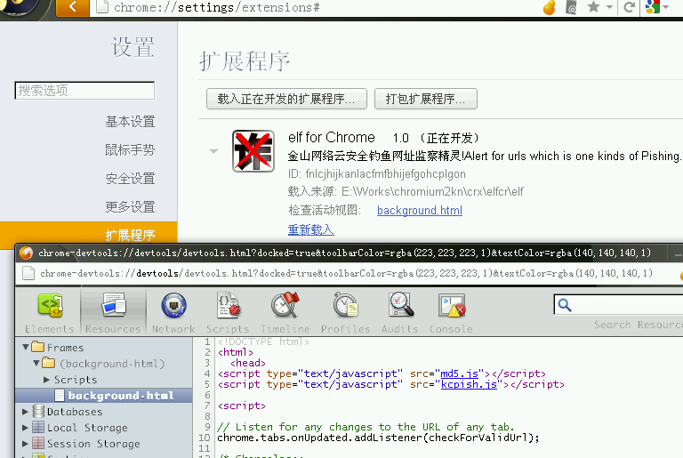
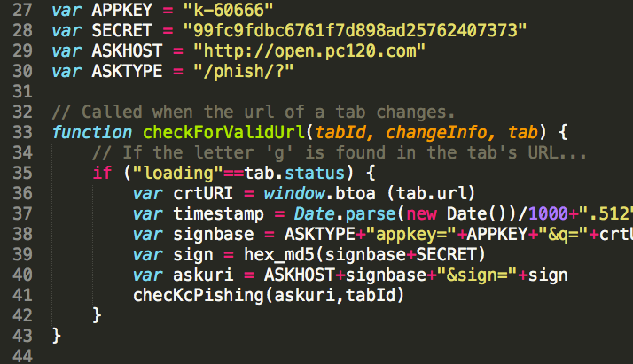

.. include:: ../LINKS.rst

+20分钟:突入 elf 
============================

google 真心好朋友,通过搜索可以获得很多已经用上 `crx`_ 的先驱们的各种代码片段

只要使用 `改.js->测试` 流程,结合以往的开发经验,驗证猜想,突进就好!

- 嗯嗯嗯,现在可以计时了: 

07:05~ 确认阵地
------------------------------------

凡事儿,预则立,不预则废物!

所以,出师要有名,得先有个名字! 嗯,结合想作的,以及依托的 `金山云安全开放平台 <http://code.ijinshan.com/api/>`_

就叫 `elf`
- elf lockup phishing 
- 钓鱼欺诈锁死精灵

manifest.json
^^^^^^^^^^^^^^^^^^^^^^^^^^^^

同前,创建新目录 `elf` 先来配置 :

::

    {"name": "elf for Chrome"
        ,"version": "1.0"
        ,"description": "金山网络云安全钓鱼网址监察精灵!Alert for urls which is one kinds of Pishing."
        ,"background_page": "background.html"
        ,"page_action" :{
            "default_icon" : "icon-19.png"
            ,"default_title" : "Here's a Pishing URL!"
            }
        ,"permissions" : [
            "tabs"
            , "notifications"
            , "http://*/*"
            ]
        ,"icons" : {
            "19" : "icon-19.png"
            ,"48" : "icon-48.png"
            ,"64" : "icon-64.png"
            ,"128" : "icon-128.png"
            }
    }

这里有几个不同的声明了:
- `background_page` ~ 因为 `elf` 是全自动运行的插件,没有用户交互,不用弹出提示,所以,指定一个作为服务器在默默运行的页面就好
- `permissions` ~ 这是因为 `crx`_ 能力太大了,几乎可以控制一切,所以,从内核就进行了全面的控制,一个扩展,想作什么,应该向内核进行备报,超过声明范畴的行为,将一概被无视!
- `icons` ~ 因为随着扩展出现的位置不同,应该提供不同规格的图标,以便内核使用,以免强行缩放效果不美

background.html
^^^^^^^^^^^^^^^^^^^^^^^^^^^^

::

    <!DOCTYPE html>
    <html>
      <head>
    
    

    
      </head>
    </html>

哈! 这是技巧,也是习惯!

- 因为什么呢? 如 :ref:`fig_1_1` 所示

.. _fig_1_1:

   插图.1-1 使用开发工具进行编程

- 内置的编辑器,其实只是个基本的编辑器,并没有自个儿平时用惯的各种专业编辑器好用

.. _fig_1_2:

   插图.1-2 喜欢的编辑环境

- 所以,将所有脚本使用外部引用,就可以使用喜欢的编辑器进行欢乐的撰写了!
- `chrome.tabs.onUpdated.addListener()` 就是抄手册来的函式,就一个作用
    - 每当用户打开一个新的 TAB 时
    - 调用自定的 `checkForValidUrl` 函式!

那么 `checkForValidUrl` 具体什么样?

kcpish.js
^^^^^^^^^^^^^^^^^^^^^

.. literalinclude:: kcpish.js
    :language: js

- 不到60行齐活儿?!
- `chrome.tabs.onUpdated.addListener()` 感应用户操作,有合适的行为就調 `checkForValidUrl()`
- `checkForValidUrl` 组织好查询链接,调 `checKcPishing` 查询远端的 金山云
- 如果有问题,用户打开的网址,就调 `showAlertMsg` 刷屏,输出警告!

搞掂?!
------------------

`checkForValidUrl()`

`JS`_ 真心 `碉堡` 了! 所有最常见的操作都内置了!

- 字串的 `base64` 编码: `Buffer(uri).toString('base64')`
- 字串的 `md5` 编码: `crypto.createHash('md5').update(字串).digest("hex")`
- 当前时间戮只能先模拟小数点后的: `Date.parse(new Date())/1000+".512"`
- `POST` 上来的数据体 `req.body.uri`
- 实际数据的引用: `req.body.uri`
- JSON数据体的解析: `JSON.parse`

37:15 ~ 小结
---------------------------

~ 这一堆,二十分鈡,整出来不难吧?

想来:
- 其实,关键功能性行为代码,就8行

    - 其中7 行全部可以在google 中直接搜索到
    - 仅仅有一行,是需要学习新的工具,安装新的组件,学习新的文档,抄进来新的函式

- 其余,都是力气活儿

    - 只要别抄錯
    - 都是赋值,赋值,赋值,赋值,,,,

- 只要注意每一步,都使用 `console.log` 吼回来,测试确认无误,就可以继续前进了,,,

`这就是脚本语言的直觉式开发调试体验!`

