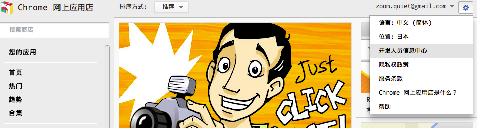
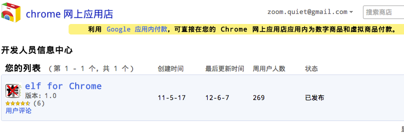

.. include:: ../LINKS.rst

+15分钟:整上 web市场
=====================

宏观步骤

#. 注册 `Gmail`_ 帐号
#. 登录,部署 `crx`_ 作品
#. 通过各种渠道宣传!

开始计时:

27:42 进入 web store
--------------------------------------------

什么是 `web store` ? 就是 `Google` 管理的类似 `Apple`_ 公司的 `app store`!
- 那,什么是 `app store` ? 
- 你!问题怎么这么多!?

总而言之, `Google`_ 的 `web store` 就是义务为所有 `crx`_ 提供的一个作品发布中心/商城/管理平台 ...
- 为一名开发者,可以方便的将 `crx`_ 作品发布出来
- 可以让全球互联网用户都可以高速的下载到我们的 `crx`_ 作品

而提供的一个服务中心!

- 当然,前提是要有 `Gmail`_ 帐号!

.. _fig_2_1:

   插图.2-1 登录后从web store的配置菜单中进入

- `开发者信息中心` 首先就是作品列表

.. _fig_2_2:

   插图.2-2 通过 `修改` 链接进入后

- 就可以看到,要求对每个 `crx`_ 有一系列的必要信息需要提供!
- 其中最麻烦,却也是最重要的,就是 图标!
    - 因为 `web store` 中的扩展是成千上万的!
    - 一个设计精良的图标,可以帮助你从一大大大大大大大堆应用图标中跳出来,贏得首批用户!

- 不过,俺不是专业的设计师,所以,使用 `Inkscape`_ 快速根据规格快速画了一组:

    - .. figure:: ../_static/figs/icon-19.png
    - .. figure:: ../_static/figs/icon-48.png
    - .. figure:: ../_static/figs/icon-64.png
    - .. figure:: ../_static/figs/icon-128.png

- 以及截了个屏

    - .. figure:: ../_static/figs/elf-snap.png

齐活儿!

最后,就是将所有,开发目录的东西,打成一个 `zip` 压缩文件,上传, `web store`_ 会作一系列测试,签名,打包什么的工作,

所有处理无误通过后,就会同步到全球上万台服务器中,完成上架,俺的自制 `crx`_ 就算面市鸟!

**BINGO!**

42:01 小结
---------------------------------

~ 整个过程,基本就是一次合法上传

- 唯一的耗时操作就是设计图标!

15分鈡,整出来不难吧?

